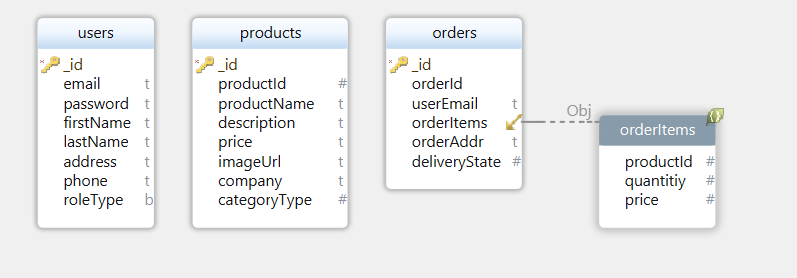

# **🪴 O2 MARKET**

<br><br>

<p align="center">


</p>

<br><br>

## **1\. 기획의도 & 목적**

#### "산지 직송 친환경 채소, 과일 쇼핑몰 등장!"

> 스마트팜에서 길러진 채소와 과일을 온라인으로 구매할 수 있는 쇼핑몰입니다.

<br/><br/>

## **2\. 웹 서비스의 최종적인 메인 기능과 서브 기능 설명**

### **✨ 메인기능**

##### - 회원가입, 로그인

##### - 마이페이지에서 배송 전 상품의 주문 취소

##### - 채소, 과일 카테고리로 나누어진 상품 목록 조회

##### - 상품 상세 페이지에서 상품의 상세 설명과 상품평 등 정보 조회

##### - 상품 상세 페이지에서 상품 장바구니 추가, 바로 구매 기능

##### - 장바구니 페이지에서 상품 구매 기능

##### - 마이페이지에서 회원정보 수정

##### - 마이페이지에서 상품의 배송 정보 조회

##### - 마이페이지에서 배송 전 상품의 주문 정보 수정

<br>

### **✨ 서브기능**

##### - 상품 목록 페이지에서 상품의 종류가 세부직으로 나뉘어있어 필터링 가능

##### - 장바구니 페이지에서 담겨진 상품의 수량 변경, 상품 삭제 가능

<br/><br/>

## **3\. 스토리보드 및 유저 시나리오**

### **⭐️ 사용자**

##### - 사용자는 메인페이지에서 회원가입 버튼을 통해 회원가입 페이지로 이동할 수 있다.

##### - 사용자는 회원가입 페이지에서 이름, 비밀번호, 이메일, 휴대폰 번호, 주소를 입력하여 회원가입할 수 있다.

##### - 사용자는 회원가입 성공 시 메인페이지로 이동한다.

##### - 사용자는 메인페이지에서 로그인 버튼을 통해 로그인 페이지로 이동할 수 있다.

##### - 사용자는 로그인 페이지에서 가입한 이메일과 비밀번호를 입력해 로그인할 수 있다.

##### - 사용자는 로그인하면 메인페이지로 이동한다.

##### - 사용자는 상단의 로그아웃 버튼을 통해 로그아웃할 수 있다.

##### - 사용자는 메인페이지에서 진행중인 이벤트와 추천 상품을 확인할 수 있다.

#### - 사용자는 메인페이지에서 상단 채소, 과일 버튼 호버 시 해당하는 세부적인 상품 종류를 확인할 수 있다.

##### - 사용자는 상단 채소, 과일 버튼을 클릭하여 해당 상품 목록 페이지로 이동할 수 있다.

##### - 사용자는 상품 목록 페이지에서 세부적인 상품의 종류를 선택할 수 있다.

##### - 사용자는 상품 목록 페이지에서 신상품순, 최고가격순, 최저가격순, 가나다순으로 상품을 정렬할 수 있다.

##### - 사용자는 상품 목록 페이지에서 상품 클릭 시 해당 상품의 상세 페이지로 이동할 수 있다.

##### - 사용자는 상품 상세 페이지에서 상품의 상세 설명과 후기 등의 정보를 확인할 수 있다.

##### - 사용자는 상품 상세 페이지에서 해당 상품을 장바구니에 추가할 수 있다.

##### - 사용자는 상품 상세 페이지에서 해당 상품을 바로 구매할 수 있다.

##### - 사용자는 장바구니 페이지에서 장바구니에 추가한 상품을 확인할 수 있다.

##### - 사용자는 장바구니 페이지에서 장바구니에 추가한 상품의 수량을 변경하거나 삭제할 수 있다.

##### - 사용자는 장바구니 페이지에서 장바구니에 담긴 상품을 구매할 수 있다.

##### - 사용자는 상단의 마이페이지 버튼을 클릭하여 마이페이지로 이동할 수 있다.

##### - 사용자는 마이페이지에서 회원 정보 수정, 최근 1개월 내의 주문 정보를 확인할 수 있다.

##### - 사용자는 마이페이지에서 최근 1개월 내의 배송 정보를 확인할 수 있다.

##### - 사용자는 마이페이지에서 배송이 시작되지 않은 상품의 주문 정보를 수정/삭제할 수 있다.

<br/><br/>

## **5\. 프로젝트 구성**

### **🔧 기술 스택**

#### **Front-end**

 
 
 


#### **Back-end**


<br>

### 🎨  **협업 도구**

#####  - Code Repository

#####  - API 사용 상세 설명

#####  - 팀원간의 실시간 커뮤니케이션 및 비대면 스크럼 진행

#####  - 컨벤션, 회의록, 정보를 공유하기 위해 활용

<br/>

### 🧬 **ERD(Entity Relationship Diagram)**

<h align="center"></h>
<br><br>

<br/>

### 📌  **스크럼**

##### - 메일 오전 10시 스크럼 진행

##### - 프론트, 백의 개발 진행상황 및 이슈 공유

<br>

#### 📎 **커밋 컨벤션**

```
# --- COMMIT END ---
#   <타입> 리스트
#   feat        : 기능 (새로운 기능)
#   fix         : 버그 (버그 수정)
#   refactor    : 리팩토링
#   design      : CSS 등 사용자 UI 디자인 변경
#   comment     : 필요한 주석 추가 및 변경
#   style       : 스타일 (코드 형식, 세미콜론 추가: 비즈니스 로직에 변경 없음)
#   docs        : 문서 수정 (문서 추가, 수정, 삭제, README)
#   test        : 테스트 (테스트 코드 추가, 수정, 삭제: 비즈니스 로직에 변경 없음)
#   chore       : 기타 변경사항 (빌드 스크립트 수정, assets, 패키지 매니저 등)
#   init        : 초기 생성
#   rename      : 파일 혹은 폴더명을 수정하거나 옮기는 작업만 한 경우
#   remove      : 파일을 삭제하는 작업만 수행한 경우
# ------------------
```

<br/><br/><br/>

## **6\. 파일 및 폴더 구성**

```
src
┣ assets
┃ ┗ images
┣ components
┃ ┣ banner
┃ ┣ layout
┃ ┣ product
┃ ┗ youtube
┣ pages
┃ ┣ 404Error
┃ ┣ cart
┃ ┣ join
┃ ┣ main
┃ ┣ modifyUserData
┃ ┣ myPage
┃ ┣ orderCompleted
┃ ┣ productDetail
┃ ┗ productList
┣ styles
┣ utils
┣ index.html
┗ app.js
```

<br/>

| **이름** | **역할**         | **담당**                                   |
| -------- | ---------------- | ------------------------------------------ |
| 이나현   | 프론트엔드, 팀장 | 메인 페이지                                |
| 김동균   | 프론트엔드       | 회원가입, 로그인, 마이페이지               |
| 조가인   | 프론트엔드       | 상품목록페이지, 상품 상세 페이지, 장바구니 |
| 경수빈   | 백엔드           | 사용자 관련 기능                           |
| 김윤지   | 백엔드           | 상품 관련 기능                             |
| 신성민   | 백엔드           | 주문 관련 기능                             |
